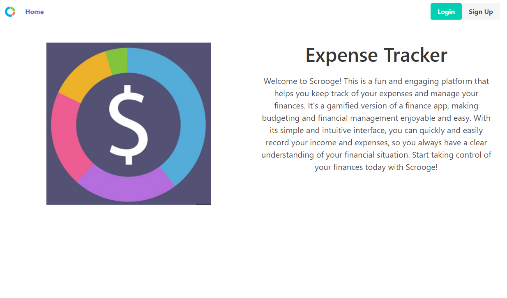
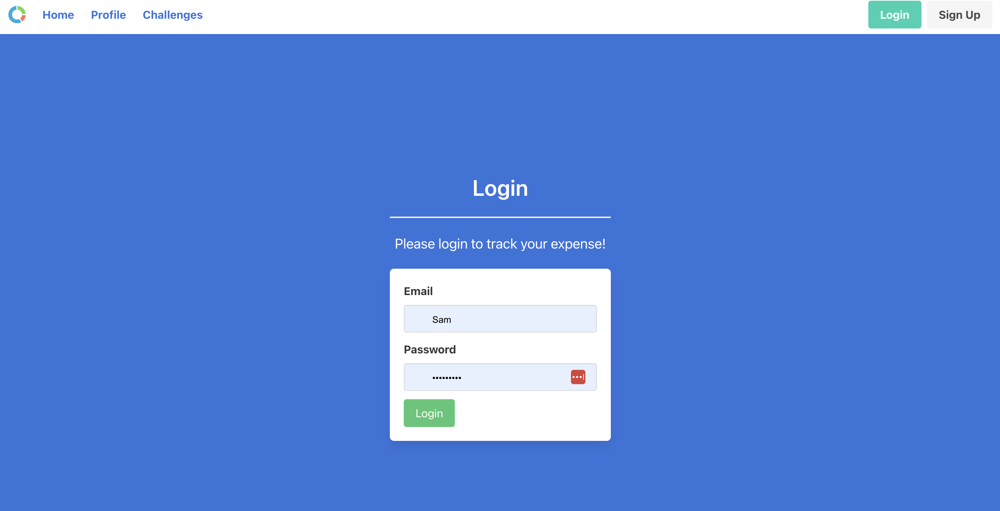
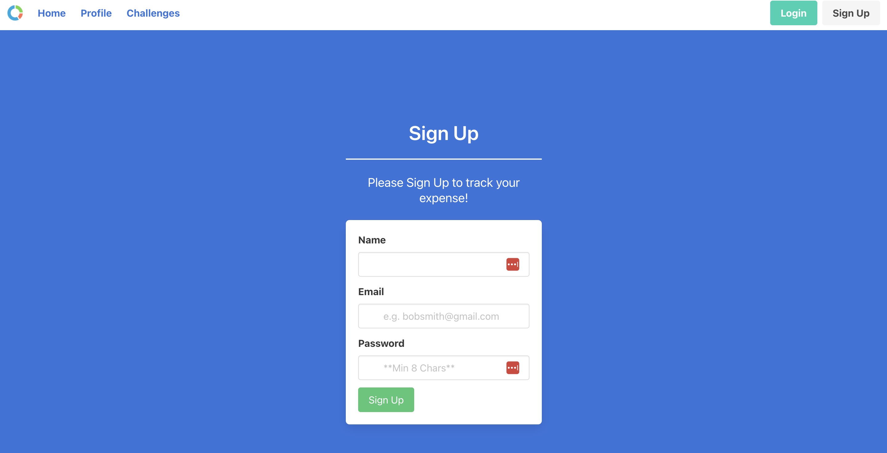
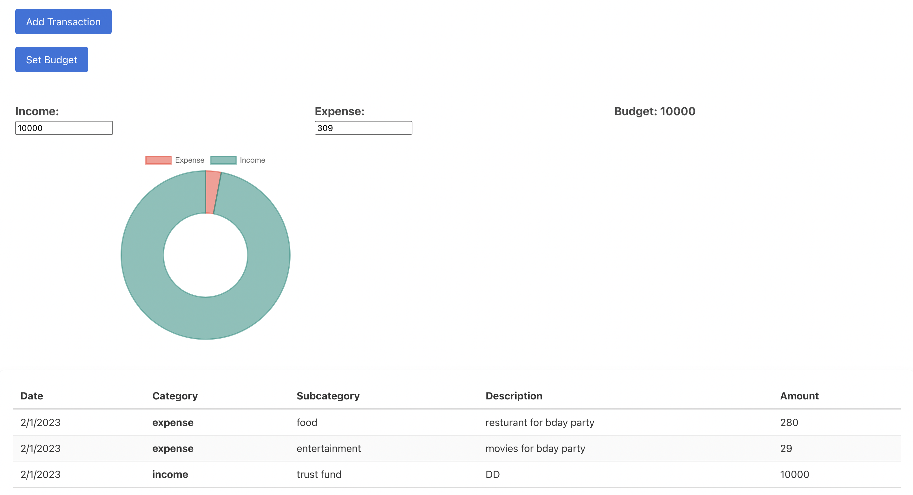
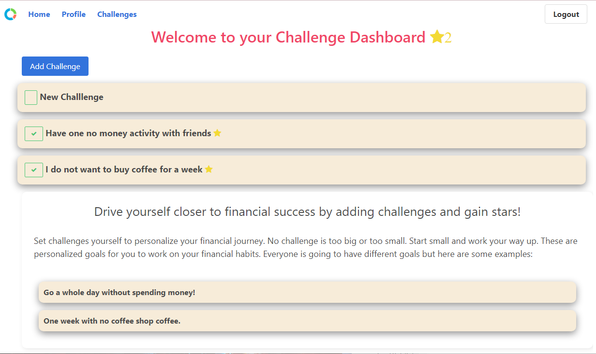

# Expense Tracker

Welcome to Scrooge, an expense tracker application! This is a fun and engaging platform that helps you keep track of your expenses and manage your finances. It's a gamified version of a finance app, making budgeting and financial management enjoyable and easy. With its simple and intuitive interface, you can quickly and easily record your income and expenses, so you always have a clear understanding of your financial situation. 

See the [Deployed Site](https://secure-anchorage-04407.herokuapp.com/)

## Table of Contents

1. [Technology Used](#technology-used)
2. [Usage](#usage)
3. [User Story](#user-story)
4. [Home Page](#home-page)
5. [Profile Page](#profile-page)
6. [Challenge Page](#challenge-page)
7. [Models & Associations](#models)
8. [API Endpoints](#api-endpoints)
9. [CSS Implementations](#css-implementations)
10. [Bonus Features](#bonus-features)
11. [Learning Points](#learning-points)
12. [Author Info](#author-info)

## Technology Used 

| Technology | Resource URL | 
| ------------- | ------------- | 
| HTML | [https://developer.mozilla.org/en-US/docs/Web/HTML](https://developer.mozilla.org/en-US/docs/Web/HTML) |
| CSS | [https://developer.mozilla.org/en-US/docs/Web/CSS](https://developer.mozilla.org/en-US/docs/Web/CSS) |
| JS | [https://developer.mozilla.org/en-US/docs/Web/JavaScript](https://developer.mozilla.org/en-US/docs/Web/JavaScript) |
| Git | [https://git-scm.com/](https://git-scm.com/) |
| NodeJs | [https://nodejs.org/docs/latest-v16.x/api//](https://nodejs.org/docs/latest-v16.x/api//) |
| ExpressJs | [https://expressjs.com/en/4x/api.html/](https://expressjs.com/en/4x/api.html/) |
| Express-sessions | [https://www.npmjs.com/package/express-session](https://www.npmjs.com/package/express-session) |
| Handlebars | [https://handlebarsjs.com/](https://handlebarsjs.com/) |
| dotenv | [https://www.npmjs.com/package/dotenv](https://www.npmjs.com/package/dotenv) |
| bcrypt | [https://www.npmjs.com/package/bcrypt](https://www.npmjs.com/package/bcrypt) |
| MySQL | [https://www.npmjs.com/package/mysql2/](https://www.npmjs.com/package/mysql2/) |
| Sequelize | [https://sequelize.org/api/v6/identifiers/](https://sequelize.org/api/v6/identifiers/) |
| Bulma | [https://bulma.io/](https://bulma.io/) |
| Chart.js | [https://www.chartjs.org/docs/latest//](https://www.chartjs.org/docs/latest//) |
| Heroku | [https://devcenter.heroku.com/categories/reference/](https://devcenter.heroku.com/categories/reference/) |

## Usage

Users will be presented with the Home Page of the application. User can choose to login/sign up. Upon successful login/sign up, they can view their Profile which shows transaction history and allow them to post new transaction or set new budget by clicking on respective buttons. Users can also set their own Challenges under Challenge tab by clicking Add Challenge button. The challenge page displays list of users challenge if any with the completion status. We used Express-session to save user session and authenticated the application using middleware.

## User Story

1. As a User,
I want to sign up,
so that I can view/post my income/expense

2. As a User,
I want to login,
so that I can view/post my income/expenses

3. As a User,
I want to record a new transaction,
so that I can track my expense

4. As a User,
I want to Set a budget,
so that I can save money

5. As a User,
I want to View the history of transactions,
I can see how much i saved

6. As a User,
I want to logout,
So my information is secured

7. As a User ,
i want to set my challenge,
I can reward with badges

## Home Page  

This is the homepage of the application where the user can sign up/login to track their expenses

## Profile Page

This page displays users transaction history, their accumulated Income/Expense and Budget. Users can click on "Add transaction" button to record new transaction. "Set Budget" button allows users to set their budget and can be updated when needed. We used Chart.js to render the Income/Expense amount.

## Challenge Page

This page allows list users challenge if available and users can set their challenge by clicking "Add Challenge" button. These are personalized goals for users to work on their financial habits. 

## Models

This application has the following Models.

* User
* Transaction
* Budget
* Challenge

Modal Association:

1. User hasMany Transaction
  
2. User hasMany Challenge

3. User hasOne Budget 

4. Transaction belongsTo User

5. Challenge belongsTo User 

6. Budget belongsTo User

## API Endpoints
 
 The application has following endpoints

 HTML route:

 1. '/' to display homepage.

 2. '/profile' to display profile page

 3. '/challenge' to display profile page

 API route:

 1. '/users/login' to implement login 

 2. '/users/logout' to implement logout 

 3. '/users/signUp' to implement signUp

 4. '/transaction/addTransaction' to record new transaction 

 5. '/budget/update' to update  budget

 6. '/budget/add' to add new  budget 

 7. '/challenge/addChallenge' to record new challenge 

 8. '/challenge/updateChallenge' to update  challenge 

## CSS Framework Implementation

To build out this project, we used the CSS framework Bulma. Bulma is a free and open-source CSS framework that is used to create responsive and modern web designs. It is based on Flexbox to create easy and responsive grid layouts. 

We used a range of pre-designed UI elements, such as forms, buttons, heros, and modals, that were easily customized to fit the needs of our project. We primarily relied on the classes associated with layouts, `columns` Thanks to the built in responsiveness, we only needed a few media queries to obtain our desired styling.

Walk through of deployed URL - https://drive.google.com/file/d/1BWXeFkqLSCiSt_EIQewhxqxUtjotpvlR/view

## Learning Points 

We learnt how to build a full stack app using HTML, CSS , JS , NodeJs, ExpressJs, MySql , sequelize , middleware, sessions & cookies, handlebars and deployed using Heroku and how to implement MVC paradigm in a full stack application

## Author Info

This project was done in collaboration with the following people:

### Becka McNally

* [LinkedIn](https://www.linkedin.com/in/becka-mcnally/)
* [Portfolio](https://beckamcnally.github.io/beckamcnally/)
* [Github](https://github.com/beckamcnally?tab=repositories)

### Daniele Bensan

* [LinkedIn]()
* [Portfolio](https://dbbensan.github.io/BensanPortfolio/)
* [Github](https://github.com/DBBENSAN?tab=repositories)

### Srinithi Ravichandran

* [LinkedIn](https://www.linkedin.com/in/srinithi-ravichandran-18891243/)
* [Portfolio](https://srinithi19.github.io/My-Portfolio/)
* [Github](https://github.com/srinithi19)

## License

MIT License